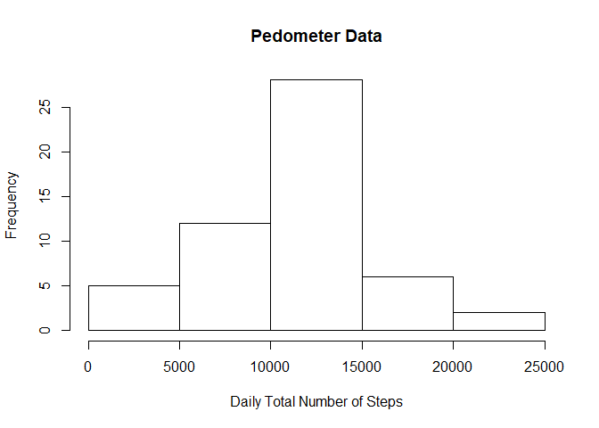
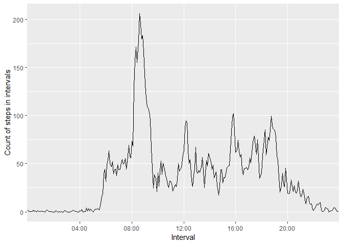
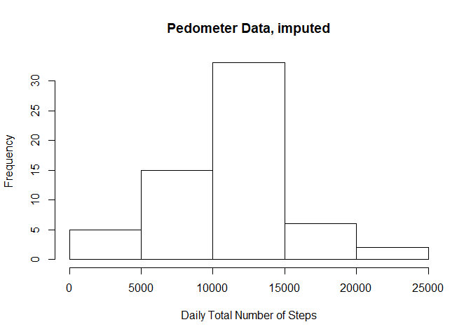
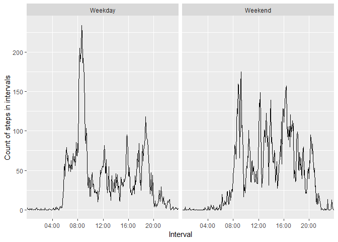

# Introduction

This note is a brief examination of some data concerning step counts, guided by a course assignment.

# The Problems

## Problem 1: Loading and preprocessing the data

### SubProblem 1.1: Load the data

Here is the initial load of needed libraries.


```r
# To clear current environment: rm(list=ls())
# To evaluate in current environment: rmarkdown::render("PA1_template.Rmd")
# To generate and keep .md: knit("PA1_template.Rmd")
library(dplyr)
library(tidyverse)
library(lubridate)
library(chron)
```

We get and unzip the data file (the download and unzipping are commented out for the nonce).


```r
# Grab the remote data zip file,unpack it into its own directory. Note the date retrieved.
url<-"https://d396qusza40orc.cloudfront.net/repdata%2Fdata%2Factivity.zip"
destfile<-"repdata_data_activity.zip"
### download.file(url,destfile)
print("date downloaded:"); print (Sys.time())
```

```
## [1] "date downloaded:"
```

```
## [1] "2019-05-30 15:54:45 MDT"
```

```r
### unzip(destfile)
```

We load data into the tibble "activity".


```r
activity <- read_csv("activity.csv")
```

```
## Parsed with column specification:
## cols(
##   steps = col_double(),
##   date = col_date(format = ""),
##   interval = col_double()
## )
```

### SubProblem 1.2: Process/transform the data (if necessary) into a format suitable for your analysis

We take a quick look at the size and data.


```r
dim(activity)
```

```
## [1] 17568     3
```

```r
activity
```

```
## # A tibble: 17,568 x 3
##    steps date       interval
##    <dbl> <date>        <dbl>
##  1    NA 2012-10-01        0
##  2    NA 2012-10-01        5
##  3    NA 2012-10-01       10
##  4    NA 2012-10-01       15
##  5    NA 2012-10-01       20
##  6    NA 2012-10-01       25
##  7    NA 2012-10-01       30
##  8    NA 2012-10-01       35
##  9    NA 2012-10-01       40
## 10    NA 2012-10-01       45
## # ... with 17,558 more rows
```

```r
tail(activity)
```

```
## # A tibble: 6 x 3
##   steps date       interval
##   <dbl> <date>        <dbl>
## 1    NA 2012-11-30     2330
## 2    NA 2012-11-30     2335
## 3    NA 2012-11-30     2340
## 4    NA 2012-11-30     2345
## 5    NA 2012-11-30     2350
## 6    NA 2012-11-30     2355
```

The data has come in with appropriate data types for steps and date, but the interval entry appears to give the initial time of the interval in 24-hour hhmm format. We left-pad the interval with 0s to 4 digits, concatenative with date, and use lubridate's ymd_hm to convert to a dttm (i.e., what lubridate calls a POSIXct) object. Add the boolean weekend and the character day of the week.


```r
activity<-mutate(activity,fourdigitinterval=sprintf("%04d",activity$interval))
activity<-mutate(activity,datetime=ymd_hm(paste(activity$date,activity$fourdigitinterval)))
activity<-mutate(activity,formattedfourdigitinterval=sub("([[:digit:]]{2,2})$", ":\\1", activity$fourdigitinterval))
activity<-mutate(activity,weekend=is.weekend(date))
activity<-mutate(activity,weekdays=weekdays(date))
head(activity,20)
```

```
## # A tibble: 20 x 8
##    steps date       interval fourdigitinterv~ datetime           
##    <dbl> <date>        <dbl> <chr>            <dttm>             
##  1    NA 2012-10-01        0 0000             2012-10-01 00:00:00
##  2    NA 2012-10-01        5 0005             2012-10-01 00:05:00
##  3    NA 2012-10-01       10 0010             2012-10-01 00:10:00
##  4    NA 2012-10-01       15 0015             2012-10-01 00:15:00
##  5    NA 2012-10-01       20 0020             2012-10-01 00:20:00
##  6    NA 2012-10-01       25 0025             2012-10-01 00:25:00
##  7    NA 2012-10-01       30 0030             2012-10-01 00:30:00
##  8    NA 2012-10-01       35 0035             2012-10-01 00:35:00
##  9    NA 2012-10-01       40 0040             2012-10-01 00:40:00
## 10    NA 2012-10-01       45 0045             2012-10-01 00:45:00
## 11    NA 2012-10-01       50 0050             2012-10-01 00:50:00
## 12    NA 2012-10-01       55 0055             2012-10-01 00:55:00
## 13    NA 2012-10-01      100 0100             2012-10-01 01:00:00
## 14    NA 2012-10-01      105 0105             2012-10-01 01:05:00
## 15    NA 2012-10-01      110 0110             2012-10-01 01:10:00
## 16    NA 2012-10-01      115 0115             2012-10-01 01:15:00
## 17    NA 2012-10-01      120 0120             2012-10-01 01:20:00
## 18    NA 2012-10-01      125 0125             2012-10-01 01:25:00
## 19    NA 2012-10-01      130 0130             2012-10-01 01:30:00
## 20    NA 2012-10-01      135 0135             2012-10-01 01:35:00
## # ... with 3 more variables: formattedfourdigitinterval <chr>,
## #   weekend <lgl>, weekdays <chr>
```

Dealing with *NA*s is explicitly handled in subsequent problems.

## Problem #2: What is mean total number of steps taken per day?

### SubProblem #2.1: Calculate the total number of steps taken per day


```r
activity_bydate <- group_by(activity,date)
activity_bydate <- filter(activity_bydate, !is.na(steps))
activity_bydate_sumsteps <- summarize(activity_bydate,stepSumsByDay=sum(steps))
activity_bydate_sumsteps
```

```
## # A tibble: 53 x 2
##    date       stepSumsByDay
##    <date>             <dbl>
##  1 2012-10-02           126
##  2 2012-10-03         11352
##  3 2012-10-04         12116
##  4 2012-10-05         13294
##  5 2012-10-06         15420
##  6 2012-10-07         11015
##  7 2012-10-09         12811
##  8 2012-10-10          9900
##  9 2012-10-11         10304
## 10 2012-10-12         17382
## # ... with 43 more rows
```

The *stepSumsByDay* values in the table *activity_bydate_sumsteps* gives the daily total steps,one for each day.

### SubProblem #2.2: Make a histogram of the total number of steps taken each day


```r
hist(activity_bydate_sumsteps$stepSumsByDay, xlab="Daily Total Number of Steps",main="Pedometer Data")
```

<!-- -->

### SubProblem #2.3: Calculate and report the mean and median of the total number of steps taken per day


```r
mean(activity_bydate_sumsteps$stepSumsByDay)
```

```
## [1] 10766.19
```

```r
median(activity_bydate_sumsteps$stepSumsByDay)
```

```
## [1] 10765
```

### Answer to Original question of Problem 2.

This reported mean answers the original question of the problem.

## Problem #3: What is the average daily activity pattern?

### SubProblem #3.1: Make a time series plot of the 5-minute interval and the average number of steps taken, averaged across all days

First we group by interval and summarize the mean steps by interval (removing NAs).


```r
activity_byinterval<-group_by(activity,formattedfourdigitinterval)
timeseries_interval_mean_steps<-summarize(activity_byinterval,intervalmean=mean(steps,na.rm=TRUE))
```

Then we plot.


```r
ggplot(timeseries_interval_mean_steps,
       aes(x=formattedfourdigitinterval,y=intervalmean,group=1))+
  geom_line()+
  scale_y_continuous(name="Count of steps in intervals")+
  scale_x_discrete(name="Interval",breaks=c("04:00","08:00","12:00","16:00","20:00"))
```

<!-- -->

### SubProblem #3.2: Which 5-minute interval, on average across all the days in the dataset, contains the maximum number of steps?

The interval containing the maximum average number of steps is


```r
index<-which.max(timeseries_interval_mean_steps$intervalmean)
paste(with(timeseries_interval_mean_steps, formattedfourdigitinterval[index]),
      with(timeseries_interval_mean_steps, formattedfourdigitinterval[index+1]),sep="-")
```

```
## [1] "08:35-08:40"
```

and that maximum average numbers of steps in that interval is:
  

```r
print(timeseries_interval_mean_steps$intervalmean[index])
```

```
## [1] 206.1698
```

### Answer to original question of Problem 3

The pattern likely indicates sleep, on average, from 11pm until 5am, with significant activity around 8:35am.

## Problem #4: Imputing missing values

### SubProblem #4.1: Calculate and report the total number of missing values in the dataset


```r
sum(is.na(activity$steps))
```

```
## [1] 2304
```

This is the number of NAs in the original dataset.

### SubProblem #4.2: Devise a strategy for filling in all of the missing values in the dataset.

As both time of day and weekday vs weekend seems plausibly to be a significant factor in number of steps taken, I would average all non-NA values across the data set which are found at the time time interval and day of the week.

### SubProblem #4.3: Generate new data set where the NAs have been filled in per the strategy given in 4.2.

First we generate the non-NA averages of day/intervals with the same day of the weekand time interval.


```r
activity_bydaybyinterval<-
  summarize(group_by(activity,
                     formattedfourdigitinterval,
                     weekdays),
            stepsX=mean(steps,na.rm = TRUE))
```

Now we join this to the original activity table,and mutate it to use the original steps if not NA, otherwise to use the imputed average.New original value orimputed value in stepsY.


```r
activity_imputevalues<-
  inner_join(activity, 
             activity_bydaybyinterval, 
             by=c("formattedfourdigitinterval","weekdays"))
activity_imputed<-
  mutate(activity_imputevalues,
         stepsY=ifelse(is.na(steps),stepsX,steps))
```

### SubProblem #4.4: Make a histogram of the total number of steps taken each day and Calculate and report the mean and median total number of steps taken per day. Do these values differ from the estimates from the first part of the assignment? What is the impact of imputing missing data on the estimates of the total daily number of steps?


```r
activity_imputed_bydate <- group_by(activity_imputed,date)
activity_imputed_bydate_sumstepsY <- summarize(activity_imputed_bydate,stepSumsByDay=sum(stepsY))
activity_imputed_bydate_sumstepsY
```

```
## # A tibble: 61 x 2
##    date       stepSumsByDay
##    <date>             <dbl>
##  1 2012-10-01         9975.
##  2 2012-10-02          126 
##  3 2012-10-03        11352 
##  4 2012-10-04        12116 
##  5 2012-10-05        13294 
##  6 2012-10-06        15420 
##  7 2012-10-07        11015 
##  8 2012-10-08         9975.
##  9 2012-10-09        12811 
## 10 2012-10-10         9900 
## # ... with 51 more rows
```

The *stepSumsByDay* values in the table *activity_imputed_bydate_sumstepsY* gives the daily total steps, one for each day, and making use of the imputed missing values.


```r
hist(activity_imputed_bydate_sumstepsY$stepSumsByDay, 
     xlab="Daily Total Number of Steps",
     main="Pedometer Data, imputed")
```

<!-- -->


```r
mean(activity_imputed_bydate_sumstepsY$stepSumsByDay)
```

```
## [1] 10821.21
```

```r
median(activity_imputed_bydate_sumstepsY$stepSumsByDay)
```

```
## [1] 11015
```

### Answer to original question of Problem 4

The mean and median are somewhat raised. They raised because day totals are the same or larger than they were before the imputed values were included, as the previous sum, and hence mean and median, simply ignored the NAs.

## Problem #5: Are there differences in activity patterns between weekdays and weekends?

### SubProblem #5.1: Create a new factor variable in the dataset with two levels – “weekday” and “weekend” indicating whether a given date is a weekday or weekend day.

We have already added in the boolean variable weekend to activity.

### SubProblem #5.2: Make a panel plot containing a time series plot of the 5-minute interval and the average number of steps taken, averaged across all weekday days or weekend days

First we group by interval and summarize the mean steps by interval.


```r
activity_imputed_byinterval<-
  group_by(activity_imputed,
           formattedfourdigitinterval,
           weekend)
timeseries_imputed_interval_mean_steps<-
  summarize(activity_imputed_byinterval,
            intervalmean=mean(steps,na.rm=TRUE))
```

Then we plot.


```r
labels=c("TRUE"="Weekend","FALSE"="Weekday")
gg=ggplot(timeseries_imputed_interval_mean_steps,
          aes(x=formattedfourdigitinterval,
              y=intervalmean,group=1))+
  geom_line()+
  scale_y_continuous(name="Count of steps in intervals")+
  scale_x_discrete(name="Interval",breaks=c("04:00","08:00","12:00","16:00","20:00"))+
  facet_grid(.~weekend,labeller=labeller(weekend=labels))
print(gg)
```

<!-- -->

### Answer to original question of Problem 5

There are distinct differences between the weekend and weekday plots of average steps during each 5 minute interval. For example, while the weekend is generally more active during the day, the weekday has a distinct activity around 8:30 that is substantially larger than any other intervals during the weekend or weekdays.

# Appendix: Miscellaneous Information

Here is what packages are loaded, and version information.


```r
sessionInfo()
```

```
## R version 3.5.3 (2019-03-11)
## Platform: x86_64-w64-mingw32/x64 (64-bit)
## Running under: Windows 10 x64 (build 17763)
## 
## Matrix products: default
## 
## locale:
## [1] LC_COLLATE=English_United States.1252 
## [2] LC_CTYPE=English_United States.1252   
## [3] LC_MONETARY=English_United States.1252
## [4] LC_NUMERIC=C                          
## [5] LC_TIME=English_United States.1252    
## 
## attached base packages:
## [1] stats     graphics  grDevices utils     datasets  methods   base     
## 
## other attached packages:
##  [1] chron_2.3-53    lubridate_1.7.4 forcats_0.4.0   stringr_1.4.0  
##  [5] purrr_0.3.2     readr_1.3.1     tidyr_0.8.3     tibble_2.1.1   
##  [9] ggplot2_3.1.1   tidyverse_1.2.1 dplyr_0.8.1    
## 
## loaded via a namespace (and not attached):
##  [1] tidyselect_0.2.5 xfun_0.7         reshape2_1.4.3   haven_2.1.0     
##  [5] lattice_0.20-38  colorspace_1.4-1 generics_0.0.2   vctrs_0.1.0     
##  [9] htmltools_0.3.6  yaml_2.2.0       utf8_1.1.4       rlang_0.3.4     
## [13] pillar_1.4.0     glue_1.3.1       withr_2.1.2      modelr_0.1.4    
## [17] readxl_1.3.1     plyr_1.8.4       munsell_0.5.0    gtable_0.3.0    
## [21] cellranger_1.1.0 rvest_0.3.4      evaluate_0.13    labeling_0.3    
## [25] knitr_1.22       fansi_0.4.0      broom_0.5.2      Rcpp_1.0.1      
## [29] scales_1.0.0     backports_1.1.4  jsonlite_1.6     hms_0.4.2       
## [33] digest_0.6.18    stringi_1.4.3    grid_3.5.3       cli_1.1.0       
## [37] tools_3.5.3      magrittr_1.5     lazyeval_0.2.2   crayon_1.3.4    
## [41] pkgconfig_2.0.2  zeallot_0.1.0    xml2_1.2.0       assertthat_0.2.1
## [45] rmarkdown_1.12   httr_1.4.0       rstudioapi_0.10  R6_2.4.0        
## [49] nlme_3.1-137     compiler_3.5.3
```

The working directory is mentioned.


```r
getwd() 
```

```
## [1] "C:/Users/david/Documents/R/datasciencecoursera/datascience-course5-week2-project1"
```

# `___END___`
